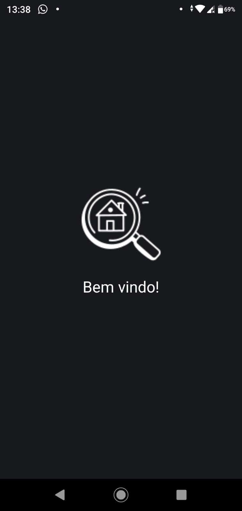
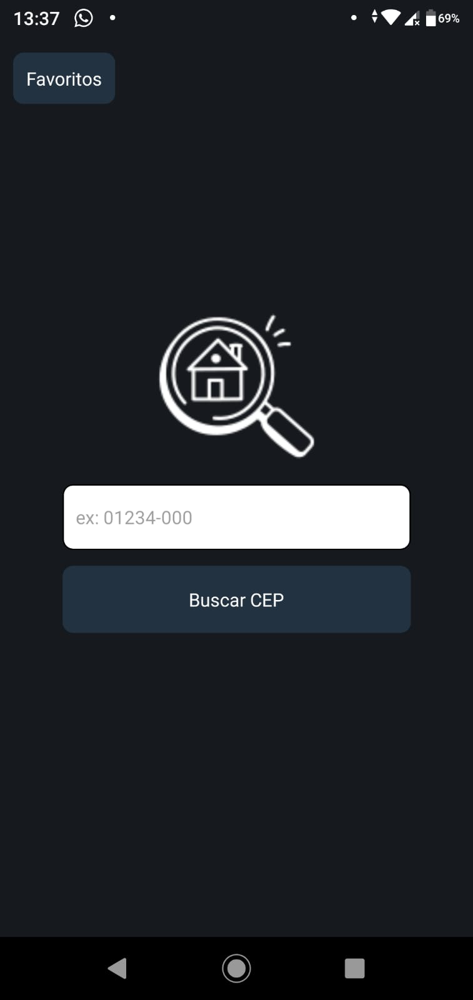
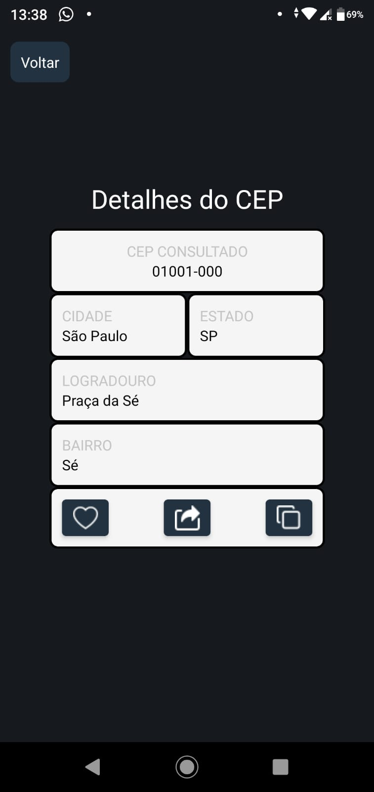
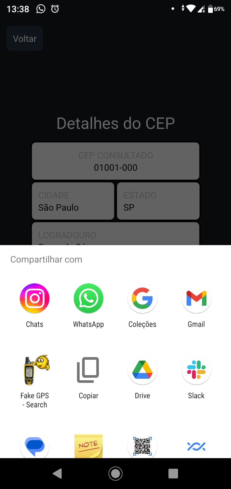
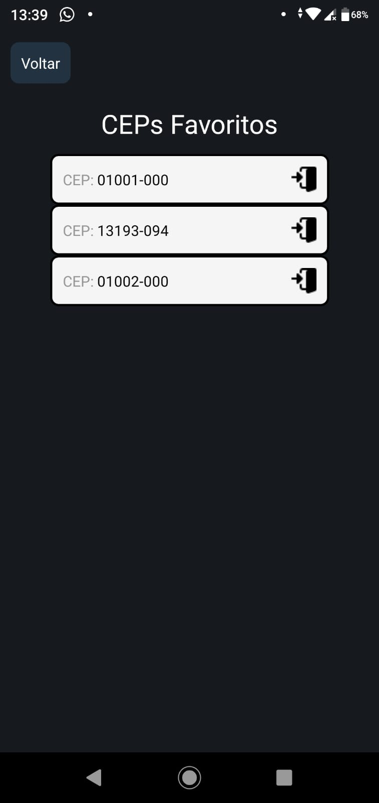
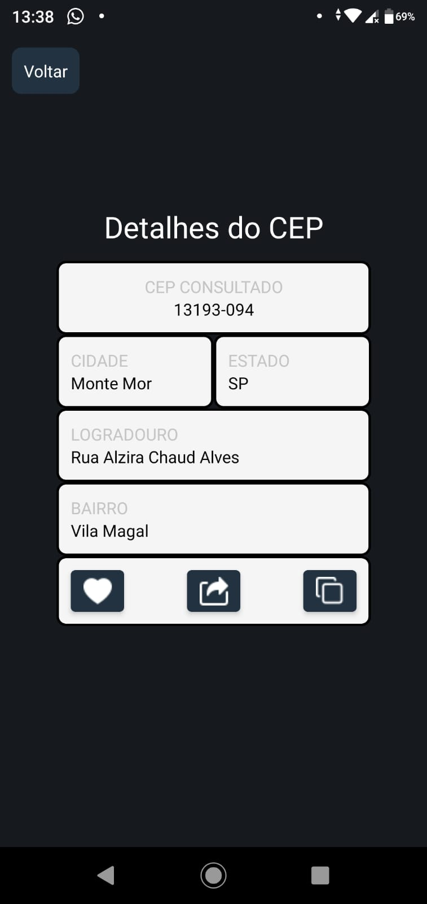

# 🚀💼 Challenge-TradeSolution-Mobile 💼🚀

## Preview:

	
 	
 	

 
 

More images

    

        
        
        
    

 
 

## Open the project yourself:

1. `git clone git@github.com:MateusHoffman/Challenge-TradeSolution-Mobile.git`
2. `cd Challenge-TradeSolution-Mobile`
3. `npm install`
4. `npm start`
5. Download the Expo Go app on mobile
6. Open it and select the QR scan code
7. Scan the QR code that appears at the terminal after the "npm Start"

## Connect with me:

	  
	
	

